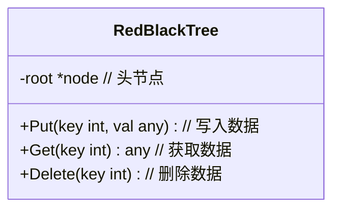

我们今天来介绍下红黑树，根据此文快速掌握红黑树这种数据结构的原理与实现

## 什么是红黑树
>红黑树是一种常用的自平衡二叉搜索树，与 AVL 树、Treap 等数据结构相比，其插入和删除操作的时间复杂度更优秀，而且难度较低。它能够在任何情况下保持平衡，因此在高效的查找、插入、删除等操作中得到广泛应用。

## 特性
- 每个节点要么是红色，要么是黑色；
- 根节点是黑色的；
- 所有叶子节点（即空节点）都是黑色的；
- 如果一个节点是红色的，则它的两个子节点都是黑色的；也就是说不能出现连续的红节点；
- 从任意一个节点到其每个叶子的所有路径都包含相同数目的黑色节点。

这些约束条件确保了红黑树在插入和删除结点时始终保持平衡，即每个结点到叶子结点的路径长度都是大致相同的，从而保证了红黑树的查找、插入和删除操作的时间复杂度为O(logn)。另外，由于红黑树内部所有的插入、删除操作都需要保证其满足着上述特点，所以相比于其他平衡树（如AVL树），红黑树的实现难度较低，而且性能表现更为稳定，因此应用广泛。

红黑树的具体实现可以使用旋转操作，向上旋转、向下旋转、左旋等操作来保证树的平衡状态。


## 实现


以下是golang版的红黑树实现代码：
<!--more-->

```go
package rbtree

// 节点颜色
const (
	RED   = true
	BLACK = false
)

// 定义节点结构体，包括键值对、左右子节点以及颜色信息
type node struct {
	key         int
	value       interface{}
	left, right *node
	color       bool
}

// RedBlackTree 定义红黑树结构体，包含根节点
type RedBlackTree struct {
	root *node
}

// NewRedBlackTree 工厂函数用于创建一个新的空树
func NewRedBlackTree() *RedBlackTree {
	return &RedBlackTree{nil}
}

// Put 插入节点，如果键已存在，则更新对应的值
func (t *RedBlackTree) Put(key int, value interface{}) {
	t.root = t.root.put(key, value)
	t.root.color = BLACK // 根节点必须为黑色
}

// Get 获取指定键对应的值，该键不存在时返回nil
func (t *RedBlackTree) Get(key int) interface{} {
	return t.root.get(key)
}

// Delete 删除指定键对应的节点，如果该键不存在则不进行任何操作
func (t *RedBlackTree) Delete(key int) {
	if t.root == nil {
		return
	}

	if !t.root.left.isRed() && !t.root.right.isRed() {
		t.root.color = RED
	}

	t.root = deleteKey(t.root, key)

	if t.root != nil {
		t.root.color = BLACK
	}
}

// 工厂函数用于初始化一个新的节点，并设置成红色
func newNode(key int, value interface{}) *node {
	return &node{key: key, value: value, color: RED}
}

// 返回节点的颜色
func (n *node) isRed() bool {
	if n == nil {
		return BLACK
	}
	return n.color
}

// 右旋操作，返回旋转后的根节点
func (n *node) rotateRight() *node {
	x := n.left
	n.left = x.right
	x.right = n
	x.color = x.right.color
	x.right.color = RED
	return x
}

// 左旋操作，返回旋转后的根节点
func (n *node) rotateLeft() *node {
	x := n.right
	n.right = x.left
	x.left = n
	x.color = x.left.color
	x.left.color = RED
	return x
}

// 颜色翻转操作
func (n *node) flipColors() {
	n.color = !n.color
	n.left.color = !n.left.color
	n.right.color = !n.right.color
}

func put(n *node, key int, value interface{}) *node {
	if n == nil {
		return newNode(key, value)
	}

	if key < n.key {
		n.left = put(n.left, key, value)
	} else if key > n.key {
		n.right = put(n.right, key, value)
	} else {
		n.value = value
	}

	/* 修改颜色可能会导致红黑树出现错误，需要进行平衡处理 */
	if n.right.isRed() && !n.left.isRed() {
		n = n.rotateLeft()
	}
	if n.left.isRed() && n.left.left.isRed() {
		n = n.rotateRight()
	}
	if n.left.isRed() && n.right.isRed() {
		n.flipColors()
	}
	return n
}

// 插入节点操作，返回更新后的根节点
func (n *node) put(key int, value interface{}) *node {
	return put(n, key, value)
}

// 获取指定键对应的节点值，该键不存在时返回nil
func (n *node) get(key int) interface{} {
	if n == nil {
		return nil
	}
	if n.key > key {
		return n.left.get(key)
	} else if n.key < key {
		return n.right.get(key)
	} else { // 找到了指定键，返回对应值
		return n.value
	}
}

// 删除节点操作，返回更新后的根节点
func deleteKey(n *node, key int) *node {
	if n == nil {
		return n // 未找到目标节点
	}

	if key < n.key {
		if !n.left.isRed() && !n.left.left.isRed() {
			n = n.moveRedLeft()
		}
		n.left = deleteKey(n.left, key)
	} else {
		if n.left.isRed() {
			n = n.rotateRight()
		}
		if key == n.key && n.right == nil {
			return nil // 找到目标节点并且没有右子节点，直接删除
		}
		if !n.right.isRed() && !n.right.left.isRed() {
			n = n.moveRedRight()
		}
		if key == n.key {
			minNode := n.right.getMinNode() // 找到右子树中最小节点
			n.key, n.value = minNode.key, minNode.value
			n.right = n.right.deleteMin() // 删除右子树中的最小节点
		} else {
			n.right = deleteKey(n.right, key)
		}
	}

	return n.balance()
}

// 调整不平衡的红黑树，返回平衡后的根节点
func (n *node) balance() *node {
	target := n
	if target.right.isRed() {
		target = target.rotateLeft()
	}
	if n.left.isRed() && n.left.left.isRed() {
		target = target.rotateRight()
	}
	if target.left.isRed() && target.right.isRed() {
		target.flipColors()
	}
	return n
}

// 将节点左移并保持红黑树平衡，返回更新后的根节点
func (n *node) moveRedLeft() *node {
	n.flipColors()

	if n.right.left.isRed() { // 右子节点含有红色节点
		n.right = n.right.rotateRight()
		target := n.rotateLeft()
		target.flipColors()
		return target
	}

	return n
}

// 将节点右移并保持红黑树平衡，返回更新后的根节点
func (n *node) moveRedRight() *node {
	n.flipColors()

	if n.left.left.isRed() { // 左子节点含有红色节点
		target := n.rotateRight()
		target.flipColors()
		return target
	}

	return n
}

// 获取当前节点下的最小节点
func (n *node) getMinNode() *node {
	if n.left == nil {
		return n
	}
	return n.left.getMinNode()
}

// 删除当前节点下的最小节点，并返回更新后的根节点
func (n *node) deleteMin() *node {
	if n.left == nil {
		return nil
	}

	if !n.left.isRed() && !n.left.left.isRed() {
		target := n.moveRedLeft()
		target.left = target.left.deleteMin()
		return target.balance()
	}

	n.left = n.left.deleteMin()
	return n.balance()
}

```