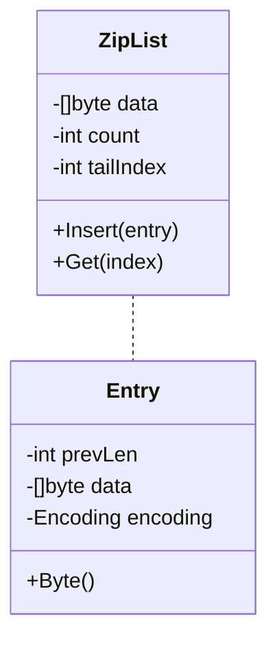

## 定义
>Redis中的Ziplist是一种压缩列表（compact list）数据结构，用于代替双端链表、哈希表等常规数据结构。它可以在内存占用较小的情况下支持随机访问，适合存储长度小且元素数量少的列表。

Ziplist将多个节点连续存储在一个紧凑的可重复利用的内存区域中，相比于双端链表、哈希表之类的数据结构，它节省了大量的内存分配和管理开销。并且，在元素个数较少的情况下，它可以更快地处理命令请求，其中包括插入、删除和遍历操作。


## 特点

- Ziplist的内存分布连续，高效利用了cache line，可以减少内存碎片和操作次数。
- 可以通过偏移量快速计算每个节点的位置，并进行快速的定位和修改。这使得Ziplist的遍历与查找操作非常高效，时间复杂度为O(1)。
- Ziplist本身就具有压缩性，节点数量较少时，可以极大地节约内存空间。如果列表已经达到了一定大小或者需要频繁更新，则Redis会自动将其转换成基于双端链表或者散列表的数据结构。

## 实现
<!--more-->
```go
package main

import (
	"encoding/binary"
)

// ZipList 用于存储元素数量、尾部元素坐标和所有数据项
type ZipList struct {
	count     int    // 元素数量
	tailIndex int    // 尾部元素坐标
	data      []byte // 用来存储整个 ZipList
}

// Encoding 使用 uint8 来标记有两种不同的编码方式
type Encoding uint8

// 定义两种具体的编码方式常量
const (
	EncodingInt = 1 // 整数编码方式
	EncodingRaw = 2 // 字符串编码方式
)

// Entry 用于存储前一项长度、当前项的编码方式以及实际数据
type Entry struct {
	prevLen  uint32   // 前一项的长度
	encoding Encoding // 当前项的编码方式
	data     []byte   // 实际数据
}

// Byte 该方法将 Entry 中的数据转换为二进制字节数组
func (e Entry) Byte() (p []byte) {
	if len(e.data) == 0 {
		return nil
	}
	length := 1 + 1 + len(e.data) // 编码格式、元素长度和元素数据之和即为总长度
	if e.prevLen > 254 {          // 如果前一项长度超过 254，则需要将 prevLen 编码成 5 个字节进行存储
		length += 4 // 因为长度需要用 5 个字节来记录，所以 length 的值比普通 Entry 组成的切片的长度大 4 个字节
		p = make([]byte, length)
		p[0] = 255                                    // 第一个字节为 255 表示后面四个字节记录的 prevLen 数据需要予以读取
		binary.BigEndian.PutUint32(p[1:5], e.prevLen) // 用 Big Endian 将 prevLen 赋给后面四个字节
		p[5] = uint8(e.encoding)
		copy(p[6:], e.data) // 将前面步骤中编码好的数据和实际数据合并拷贝到新的字节数组中去
	} else { // 如果 prevLen 不到 254，则只需将其编码成一个字节即可
		p = make([]byte, length)
		p[0] = uint8(e.prevLen)
		p[1] = uint8(e.encoding)
		copy(p[2:], e.data)
	}

	return
}

// NewEntry 函数返回一个条目 Entry 结构体，其中 Encoding、Value 参数用于构造 Byte() 方法中调用的 Entry 对象
func NewEntry(encoding Encoding, value []byte) Entry {
	return Entry{prevLen: 0, data: value, encoding: encoding}
}

// NewStringEntry 函数基于 NewEntry() 返回一个字符串类型的新条目（使用 Raw 编码）
func NewStringEntry(value string) Entry {
	return NewEntry(EncodingRaw, []byte(value))
}

// NewIntEntry 函数基于 NewEntry() 返回一个整数类型的新条目（使用 Int 编码）
func NewIntEntry(value uint32) Entry {
	p := make([]byte, 4)
	binary.BigEndian.PutUint32(p, value)

	return NewEntry(EncodingInt, p)
}

// decodeEntry 函数通过字节切片解码成一个原始数据项
func decodeEntry(value []byte) Entry {
	if len(value) == 0 {
		return Entry{} // 如无数据，返回一个空的条目结构体
	}
	entry := Entry{prevLen: uint32(value[0])} // 第一个字节存储了前一项的长度，用它来初始化 entry 结构
	if entry.prevLen > 254 {                  // 如果第一个字节是 255，则表示 prevLen 的值需要读取后面的五个字节（Big Endian）
		entry.prevLen = binary.BigEndian.Uint32(value[1:5])
		entry.encoding = Encoding(value[5]) // 后一个字节会标记添加到ZipList中的内容编码方式：是raw还是integer.
		entry.data = value[6:]              // 其他字节最终都将被视为数据存放在Data字段内
	} else {
		entry.encoding = Encoding(value[1])
		entry.data = value[2:]
	}

	return entry
}

// New 函数返回一个 ZipList 指针类型的实例，定义其中的data 切片预先分配空间大小为1024
func New() *ZipList {
	return &ZipList{data: make([]byte, 0, 1024)}
}

// Insert 方法以Append模式添加一个字节数组，输入为一个条目的实例。该方法插入新数据后会更新元素数量和总字节数
func (list *ZipList) Insert(entry Entry) {
	lastEntry := list.getLastEntry()              // 获取列表中最后一个项的实例
	entry.prevLen = uint32(len(lastEntry.Byte())) // 用引用记录前一项的长度

	list.count++
	list.tailIndex = len(list.data)
	list.data = append(list.data, entry.Byte()...)
}

// Get 方法以index 位置的顺序（从0开始）返回一个切片字节串。如果传入值是 -1，则函数返回 ZipList 尾部最后一个内容块；否则，先查找出index 这个 entry 的起始和结束位置，然后解码这个 entry 并返回其中存储的数据。
func (list *ZipList) Get(index int) (value []byte) {
	entry := list.getLastEntry()
	if index == -1 {
		return entry.data
	}
	start := list.tailIndex //初始化其实位置依据入参“index”指定的项所求出的起始位置
	end := len(list.data)
	for i := list.count; i > index; i-- {
		entry = decodeEntry(list.data[start:end])
		end = start
		start = start - int(entry.prevLen)
	}

	return entry.data

}

// getLastEntry 获取最后一个entry
func (list *ZipList) getLastEntry() Entry {
	last := list.data[list.tailIndex:]
	return decodeEntry(last)
}

```

- 测试
```go

import (
	"encoding/binary"
	"github.com/stretchr/testify/assert"
	"testing"
)

func TestZipList(t *testing.T) {
	list := New()
	list.Insert(NewStringEntry("foo"))
	list.Insert(NewStringEntry("bar"))
	list.Insert(NewIntEntry(10086))
	assert.Equal(t, "foo", string(list.Get(0)))
	assert.Equal(t, "bar", string(list.Get(1)))

	assert.Equal(t, uint32(10086), binary.BigEndian.Uint32(list.Get(2)))
}
```